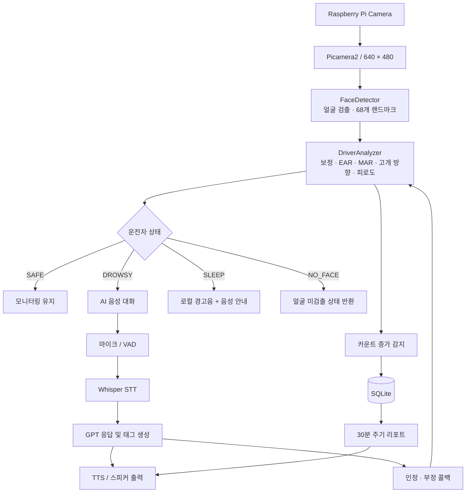

[README.md](https://github.com/user-attachments/files/32465891/README.md)
# RPi Drowsiness Detection

**Raspberry Pi 기반 운전자 졸음 감지 및 AI 음성 대화 시스템**

카메라 영상에서 운전자의 얼굴과 눈·입 랜드마크를 분석하고, 졸음 징후가 나타나면 음성 대화 또는 경고음으로 대응하는 Python 프로젝트입니다. 개인별 눈 크기 보정, 눈 감김 지속 프레임 분석, 하품·깜빡임 점수 누적, 음성 인식과 응답 생성, SQLite 이벤트 기록을 하나의 모니터링 흐름으로 구성했습니다.

> 현재 구현은 Raspberry Pi 카메라와 오디오 장치를 사용하는 실험용 프로토타입입니다. 감지 정확도·처리 속도·차량 환경에서의 성능은 별도 측정이 필요하며, 이 문서의 설정값은 성능 보장 수치가 아닌 코드의 기본값입니다.

## 목차

- [프로젝트 개요](#프로젝트-개요)
- [주요 기능](#주요-기능)
- [시스템 구성](#시스템-구성)
- [기술 스택 및 준비물](#기술-스택-및-준비물)
- [디렉터리 구조](#디렉터리-구조)
- [졸음 감지 알고리즘](#졸음-감지-알고리즘)
- [음성 대화 및 경고 처리](#음성-대화-및-경고-처리)
- [설치 및 환경 설정](#설치-및-환경-설정)
- [실행 및 사용 방법](#실행-및-사용-방법)
- [설정값 안내](#설정값-안내)
- [데이터 저장 및 리포트](#데이터-저장-및-리포트)
- [문제 해결](#문제-해결)
- [현재 한계와 개선 계획](#현재-한계와-개선-계획)
- [검증 및 시연 가이드](#검증-및-시연-가이드)
- [참고 자료 및 라이선스](#참고-자료-및-라이선스)

## 프로젝트 개요

이 프로젝트는 운전자의 얼굴 영상에서 졸음과 관련된 변화를 찾아 단계적으로 개입하는 시스템을 구현합니다.

단순히 한 프레임에서 눈이 작게 보이는지만 확인하지 않고, 개인별 기준값과 눈 감김의 지속성, 최근 일정 시간 동안 발생한 하품·깜빡임을 함께 고려합니다. 웃음과 대화처럼 눈과 입 모양이 달라지는 상황에는 별도 필터를 적용합니다.

영상 분석은 Raspberry Pi에서 수행하며, 음성 인식·대화 생성·음성 합성에는 OpenAI API를 사용합니다. 따라서 영상 분석과 로컬 파일 경고음 재생은 로컬 처리이지만, 전체 프로그램을 현재 형태로 실행하려면 API 키가 필요하고 음성 대화에는 네트워크 연결이 필요합니다.

현재 코드는 `main` 브랜치의 `10d25ba` 커밋을 기준으로 설명합니다. 설치 절차는 코드 의존성과 공식 문서를 바탕으로 정리한 안내이며, 해당 커밋에는 검증된 OS·패키지 버전 목록이나 벤치마크 결과가 포함되어 있지 않습니다.

## 주요 기능

| 기능 | 구현 내용 |
| --- | --- |
| 카메라 입력 | Picamera2로 640×480 프레임 수집 |
| 얼굴 검출 | dlib HOG 얼굴 검출기 사용, 여러 얼굴 중 가장 큰 얼굴 선택 |
| 얼굴 랜드마크 | dlib 68포인트 모델로 눈·입·얼굴 주요 좌표 추출 |
| 개인별 보정 | 유효 EAR 샘플 50개로 눈 감김 기준 설정, 입 너비 기준 수집 |
| 눈 감김 분석 | 양쪽 눈의 평균 EAR와 지속 프레임 수를 기준으로 상태 판정 |
| 하품 분석 | MAR와 연속 프레임 조건으로 피로도 점수 추가 |
| 누적 피로도 | 최근 180초 동안 발생한 이벤트 점수를 합산 |
| 웃음 필터 | 평소보다 넓어진 입 너비를 감지하고 눈 감김 오인식을 줄이는 필터 적용 |
| 고개 방향 분석 | `solvePnP` 기반 좌우 회전각 추정 및 `SIDE LOOK` 화면 표시 |
| 음성 대화 | WebRTC VAD → Whisper STT → GPT 응답 → TTS 재생 |
| 단계별 개입 | `DROWSY` 상태에서 대화 시작, `SLEEP` 상태에서 경고음 처리 |
| 이벤트 기록 | 카운트 증가를 감지하면 SQLite에 `SLEEP` 이벤트 저장 |
| 주기적 안내 | 30분마다 최근 기록을 조회하고 조건에 따라 음성 리포트 제공 |

고개 돌림은 현재 별도의 경고음을 발생시키지 않습니다. 얼굴 미검출 시 `NO_FACE`를 반환하지만, 메인 루프에는 이 상태에 대한 별도 음성 경고가 구현되어 있지 않습니다.

## 시스템 구성



### 모듈별 역할

| 모듈 | 주요 역할 |
| --- | --- |
| `main.py` | 모듈 초기화, 영상 처리 루프, 개입 우선순위, 스레드 실행, 키 입력, DB 기록 연결 |
| `src/detector.py` | 얼굴 검출, 얼굴 영역 확장, 랜드마크 배열 생성 |
| `src/analyzer.py` | 개인별 보정, 지표 계산, 상태 판정, 점수 및 카운트 관리 |
| `src/chatbot.py` | 녹음, VAD, STT, 대화 생성, TTS, 경고음, 분석기 콜백 |
| `src/database.py` | SQLite 테이블 생성, 이벤트 삽입, 최근 N분 이벤트 수 조회 |
| `src/utils.py` | EAR·거리·입 너비 계산, 현재 사용되지 않는 감마 보정 함수 |

### 실행 구조

- **메인 스레드:** 프레임 수집, 얼굴 검출, 상태 분석, 화면 표시.
- **대화 스레드:** 녹음과 외부 API 호출, 응답 재생.
- **알람 스레드:** 경고음과 휴식 안내 재생.
- **리포트 스레드:** 1,800초 간격의 DB 조회와 음성 안내.

대화와 알람을 별도 스레드에서 실행하여 영상 루프와 분리합니다. 다만 현재 오디오 재생 객체와 상태 플래그를 여러 스레드가 공유하므로, 알람 선점과 동시 실행에 대한 보완이 필요합니다.

## 기술 스택 및 준비물

### 소프트웨어

| 구성 요소 | 용도 |
| --- | --- |
| Python 3 | 애플리케이션 실행 |
| Picamera2 / libcamera | Raspberry Pi 카메라 제어 |
| OpenCV | 색상 변환, 화면 표시, 윤곽선 및 고개 방향 계산 |
| dlib | 얼굴 검출 및 얼굴 랜드마크 추정 |
| NumPy | 좌표·벡터 연산 |
| PyAudio | 마이크 입력 |
| WebRTC VAD | 음성 구간 판별 |
| pygame | 경고음 및 합성 음성 재생 |
| OpenAI Python SDK | STT·대화·TTS API 호출 |
| python-dotenv | `.env` 환경변수 로드 |
| SQLite | 이벤트 저장, Python 표준 라이브러리 `sqlite3` 사용 |

### 하드웨어 및 실행 환경

| 준비물 | 설명 |
| --- | --- |
| Raspberry Pi | 코드의 창 제목은 Pi 5를 기준으로 작성되어 있음. 다른 보드의 성능·호환성은 별도 확인 필요 |
| Picamera2 호환 카메라 | 코드 주석에는 Camera Module 3 Wide가 언급됨. 실제 사용 모델과 렌즈는 확인 필요 |
| 마이크 | 기본 입력 장치로 인식되는 마이크. 코드 입력 설정은 16 kHz, 모노, 16비트 PCM |
| 스피커 또는 오디오 출력 장치 | pygame에서 재생 가능한 출력 장치 |
| 디스플레이 및 GUI 세션 | 현재 `cv2.imshow()` 기반 결과 창과 키 입력 사용 |
| 네트워크 | 음성 인식·대화·음성 합성 API 호출에 사용 |
| OpenAI API 키 | `OPENAI_API_KEY` 환경변수로 제공 |

현재 소스에는 GPIO 부저·LED·LCD·GPS 제어가 없습니다. 경고음은 스피커를 통해 파일로 재생하며, USB 웹캠용 `cv2.VideoCapture()` 경로도 별도로 구현되어 있지 않습니다.

## 디렉터리 구조

아래는 실행에 필요한 파일을 포함한 구조입니다. `README.md`는 이 문서이며, `.env`와 `models/` 내부 모델은 사용자가 준비해야 합니다.

```text
Rpi-Drowsiness-Detection/
├── README.md
├── main.py
├── .gitignore
├── .env                              # 직접 생성: OPENAI_API_KEY
├── models/                           # 직접 생성
│   └── shape_predictor_68_face_landmarks.dat
├── sounds/
│   └── alarm.wav                     # 로컬 경고음
├── src/
│   ├── __init__.py
│   ├── detector.py
│   ├── analyzer.py
│   ├── chatbot.py
│   ├── database.py
│   └── utils.py
├── driving_log.db                    # 운행 이벤트 DB
├── user_input.wav                    # 음성 입력 중간 파일
└── ai_response.mp3                   # TTS 출력 중간 파일
```

현재 저장소에는 `driving_log.db`, `user_input.wav`, `ai_response.mp3`가 이미 포함되어 있습니다. 이들은 실행 중 생성·갱신되는 데이터이므로 소스 코드와 분리하여 관리하는 것이 좋습니다. 다운로드한 DB에 기존 기록이 있으면 리포트 조회에 포함될 수 있습니다.

## 졸음 감지 알고리즘

### 1. 얼굴 및 랜드마크 검출

1. 카메라 프레임을 캡처하고 OpenCV 분석용 영상으로 변환합니다.
2. 흑백 영상에서 dlib HOG 얼굴 검출기를 실행합니다.
3. 여러 얼굴이 검출되면 면적이 가장 큰 얼굴을 선택합니다.
4. 얼굴 영역을 위·아래 약 10% 확장합니다. 좌우 패딩은 0%입니다.
5. 68포인트 랜드마크를 추출합니다. 확장된 영역에서 추출에 실패하면 원래 영역으로 재시도합니다.

가장 큰 얼굴을 선택하는 방식은 운전자 신원 확인이나 좌석 위치 추적이 아닙니다. 카메라는 운전자 한 명이 안정적으로 보이도록 배치해야 합니다.

### 2. 개인별 캘리브레이션

프로그램 시작 시 `CALIBRATING` 단계에서 평소 눈 크기와 입 너비를 측정합니다.

- 양쪽 눈 평균 EAR가 `0.15`보다 큰 샘플을 50개 수집합니다.
- EAR 샘플을 정렬하고 인덱스 `int(N × 0.90)`의 값을 평소 눈 크기로 선택합니다.
- 눈 감김 임계값은 `max(0.20, 평소 눈 크기 × 0.85)`로 설정합니다.
- 수집한 입 너비의 중앙값을 웃음 필터의 기준으로 사용합니다.

보정 중에는 얼굴을 정면으로 두고 평소처럼 눈을 뜬 상태를 유지합니다. 웃거나 크게 입을 벌리면 입 너비 기준에 영향을 줄 수 있습니다. 보정 시간은 유효 샘플 수와 실제 FPS에 따라 달라집니다.

### 3. EAR: 눈 감김 판단

눈 주변 6개 점에서 세로 거리 두 쌍과 가로 거리를 계산합니다.

```text
EAR = (‖p2 - p6‖ + ‖p3 - p5‖) / (2 × (‖p1 - p4‖ + ε))
ε = 0.000001

평균 EAR = (왼쪽 눈 EAR + 오른쪽 눈 EAR) / 2
```

평균 EAR가 개인별 임계값보다 낮고 웃음·하품·고개 돌림 필터에 해당하지 않으면 눈 감김 카운터를 증가시킵니다.

| 상황 | 현재 판정 조건 |
| --- | --- |
| 일반 모니터링 | 눈 감김 카운터 30프레임 이상 |
| 대화 세션 진행 중 | 눈 감김 카운터 60프레임 이상 |
| 최초 눈 감김 경고 | `sleep_trigger_count == 0`이며 `drowsiness_count == 0`이면 `DROWSY` |
| 이후 조건 충족 | 위 최초 조건에 해당하지 않으면 `SLEEP` |

**30프레임은 항상 1초가 아닙니다.** 30 FPS이면 약 1초, 15 FPS이면 약 2초, 10 FPS이면 약 3초입니다. 현재 판정은 시간 기반이 아니라 프레임 기반입니다.

또한 현재 구현에서는 일부 필터 구간에서 눈 감김 카운터가 초기화되지 않고 남을 수 있습니다. 따라서 모든 상황에서 엄격한 의미의 연속 눈 감김 시간을 측정한다고 보기는 어렵습니다.

눈이 떠 있다고 판단한 프레임에서는 평소 눈 크기를 `기존값 × 0.99 + 현재 EAR × 0.01`로 갱신하고 임계값을 다시 계산합니다.

### 4. MAR: 하품 판단

입 랜드마크의 두 세로 거리와 가로 너비를 이용합니다. 아래 인덱스는 dlib 전체 랜드마크의 0 기반 번호입니다.

```text
MAR = (‖p50 - p58‖ + ‖p52 - p56‖) / (2 × ‖p48 - p54‖)
```

- `MAR > 0.6`이고 웃음·대화 상태가 아닐 때 하품 카운터를 증가시킵니다.
- 카운터가 30프레임에 도달하면 `Yawn` 이벤트로 30점을 추가합니다.
- 같은 입 벌림이 지속되는 동안 매 프레임 점수를 추가하지는 않습니다.
- 하품 안내는 화면에 표시하지만, 현재 `process()`는 독립적인 `YAWN` 상태를 반환하지 않습니다.

### 5. 최근 3분 피로도 점수

| 이벤트 | 조건 | 점수 |
| --- | --- | ---: |
| `Yawn` | 하품 카운터가 30프레임 도달 | +30 |
| `Fast Blink` | 눈을 다시 떴을 때 직전 눈 감김 카운터가 5보다 크고 경고 기준 미만 | +5 |

최근 180초 미만의 이벤트만 합산하며, 합계가 **80점 이상**이고 현재 상태가 `SAFE`이면 `DROWSY`로 변경합니다. 예를 들어 유효 시간 안에 하품 3회가 기록되면 90점으로 조건을 충족합니다. 이는 코드 동작 예시이며 의학적으로 검증된 피로도 척도는 아닙니다.

이 점수 목록은 메모리에만 유지합니다. SQLite에는 개별 하품·깜빡임 점수를 저장하지 않습니다.

### 6. 웃음·대화·고개 돌림 필터

| 필터 | 조건 및 처리 |
| --- | --- |
| 웃음 | 입 너비가 보정 기준의 1.3배를 초과하면 웃음으로 판단 |
| 웃음 이후 유예 | 마지막 웃음 이후 3초간 눈 감김·하품 판정 제한 |
| 깜빡임 점수 취소 | 웃음 감지 시 최근 2초 내 `Fast Blink` 점수 제거 |
| 대화 | 세션 전체에서 `is_speaking=True`, 하품 및 피로도 점수 추가 제한, 눈 감김 기준 2배 |
| 고개 돌림 | 추정 yaw 절댓값이 40도 초과이면 `SIDE LOOK` 표시 및 눈 감김 판정 제한 |

`is_speaking`은 마이크가 실제 발화를 감지한 순간만 나타내는 값이 아니라, 대화 세션의 시작부터 종료까지 유지되는 값입니다.

고개 방향 계산은 고정된 카메라 행렬과 왜곡 계수 0을 사용합니다. 실제 렌즈를 보정한 값이 아니므로 각도를 정밀 측정값으로 해석해서는 안 됩니다.

### 7. 위험 상태 유지

눈 감김으로 `DROWSY` 또는 `SLEEP`이 발생하면 해당 상태를 3초 동안 유지합니다. 현재 코드는 이 구간에서 새로운 얼굴·눈·입 분석을 건너뛰고 이전 상태를 반환합니다.

따라서 유지 중인 `SLEEP`이 반드시 현재 프레임의 눈 감김을 의미하지는 않습니다. 화면 표시 유지와 실시간 판정은 분리할 필요가 있습니다.

## 음성 대화 및 경고 처리

### 음성 처리 순서

```text
졸음 감지
  → 시작 안내 음성
  → 마이크 녹음 및 VAD
  → whisper-1 음성 인식
  → gpt-4o 응답 생성
  → 응답 태그 해석
  → tts-1 / onyx 음성 합성
  → pygame 재생 및 분석기 상태 갱신
```

모델 이름은 현재 코드에 지정된 값입니다. 모델 접근 권한과 서비스 제공 여부는 사용하는 계정에서 확인해야 합니다.

### 녹음 설정

| 항목 | 기본값 |
| --- | --- |
| 샘플링 주파수 | 16,000 Hz |
| 채널 | 모노 |
| 데이터 형식 | 16비트 PCM |
| VAD 프레임 길이 | 30 ms, 480샘플 |
| VAD 모드 | 3 |
| 발화 종료 | 발화 시작 후 비음성 구간이 1,000 ms 초과 |
| 녹음 시도 제한 | 시작 후 총 10초 |
| 최소 저장 길이 | 약 0.5초 분량의 수집 프레임 |

10초 제한은 말하기 전 대기 시간만이 아니라 한 녹음 시도 전체에 적용됩니다. VAD는 음성 구간을 판별하지만 녹음 파형에서 배경 소음을 제거하는 기능은 아닙니다.

### 응답 태그와 동작

| 응답 태그 | 현재 동작 |
| --- | --- |
| `[부정]` | 분석기의 점수와 카운트를 초기화하고 캘리브레이션 재시작, 대화 종료 |
| `[인정]` | 세션당 한 번 점수를 비우고 `drowsiness_count` 증가, 대화 계속 |
| `[종료]` | 현재 대화 세션 종료, 영상 모니터링은 계속 |
| 태그 없음 | 일반 응답 재생 |

태그는 음성 재생 전에 제거합니다. 한 세션은 최대 5번의 루프를 수행하며 녹음·인식 실패 시도도 여기에 포함됩니다. 연속 침묵과 인식 실패 종료 기준은 실제 조건문상 각각 2회입니다. 일부 출력 문구는 3회라고 되어 있어 수정이 필요합니다.

### 경고 우선순위

1. 알람 스레드 실행 중에는 새 대화나 알람을 추가하지 않습니다.
2. 대화 중 `SLEEP`이면 최초 카운트 조건에서 1초 유예를 적용하고, 이미 카운트가 있으면 즉시 알람 전환을 시도합니다.
3. 일반 모니터링 중 `SLEEP`이면 알람을 시작합니다.
4. 일반 모니터링 중 `DROWSY`이면 대화를 시작합니다.

알람은 `sounds/alarm.wav`를 최대 약 3초 동안 재생한 뒤 휴식을 권하는 TTS를 시도합니다. 현재 스레드 중단 플래그 공유 때문에 대화에서 알람으로 전환할 때 경쟁 조건이 발생할 수 있습니다.

## 설치 및 환경 설정

아래는 **Raspberry Pi OS의 GUI 환경**을 가정한 설치 예시입니다. 저장소에는 아직 `requirements.txt`나 검증된 버전 고정 파일이 없으므로 실제 장비에서 설치와 동작을 확인해야 합니다.

### 1. 저장소 다운로드

```bash
git clone https://github.com/codingSkeleton6478/Rpi-Drowsiness-Detection.git
cd Rpi-Drowsiness-Detection
```

### 2. 시스템 패키지 설치

Picamera2는 libcamera와의 호환성을 위해 Raspberry Pi 공식 안내의 apt 설치 방식을 사용합니다. [Picamera2 설치 문서](https://github.com/raspberrypi/picamera2#installation)

```bash
sudo apt update
sudo apt install -y \
  python3-picamera2 python3-opencv python3-numpy \
  python3-venv python3-dev python3-pip \
  build-essential cmake pkg-config \
  portaudio19-dev libasound2-dev \
  wget bzip2 alsa-utils
```

### 3. 가상환경 구성

시스템에 설치한 Picamera2·OpenCV·NumPy를 가상환경에서도 사용하도록 설정합니다.

```bash
python3 -m venv --system-site-packages .venv
source .venv/bin/activate
python -m pip install --upgrade pip
python -m pip install dlib openai python-dotenv pygame PyAudio webrtcvad
```

dlib은 환경에 따라 소스 빌드가 필요합니다. 빌드 실패 시 CMake·컴파일러·메모리 상태와 Python 버전을 확인합니다. 이 프로젝트는 `cv2.imshow()`를 사용하므로 GUI 기능이 없는 OpenCV 패키지만 설치하면 화면 출력이 불가능합니다.

### 4. 얼굴 랜드마크 모델 준비

모델 파일은 저장소에 포함되어 있지 않습니다. dlib 공식 예제에서 안내하는 68포인트 모델을 준비합니다. [dlib 얼굴 랜드마크 예제](https://dlib.net/face_landmark_detection.py.html)

```bash
mkdir -p models
wget https://dlib.net/files/shape_predictor_68_face_landmarks.dat.bz2 \
  -O models/shape_predictor_68_face_landmarks.dat.bz2
bzip2 -d models/shape_predictor_68_face_landmarks.dat.bz2
```

최종 경로는 다음과 같아야 합니다.

```text
models/shape_predictor_68_face_landmarks.dat
```

### 5. 환경변수 설정

프로젝트 루트에 `.env` 파일을 생성하고 본인의 API 키를 입력합니다.

```dotenv
OPENAI_API_KEY=your_openai_api_key_here
```

키는 소스 코드나 README에 직접 입력하지 않습니다. 현재 `DriverChatbot`이 시작 단계에서 생성되므로 API 키 없이 카메라 기능만 실행하는 모드는 지원하지 않습니다.

### 6. 카메라 확인

Raspberry Pi OS Bookworm 이후의 카메라 도구는 `rpicam-*` 이름을 사용합니다. [Raspberry Pi 카메라 문서](https://www.raspberrypi.com/documentation/computers/camera_software.html)

```bash
rpicam-hello --list-cameras
rpicam-hello --timeout 5000
```

카메라 확인 프로그램을 종료한 뒤 본 프로그램을 실행합니다.

### 7. 오디오 장치 확인

```bash
arecord -l
aplay -l
```

아래 명령으로 짧은 테스트 녹음을 저장하고 재생할 수 있습니다.

```bash
arecord -D default -f S16_LE -r 16000 -c 1 -d 3 /tmp/mic-test.wav
aplay /tmp/mic-test.wav
```

기본 입력 장치가 원하는 마이크인지 확인합니다. 현재 코드는 별도 마이크 인덱스를 지정하지 않습니다.

경고음 파일도 확인합니다.

```bash
test -f sounds/alarm.wav && echo "Alarm file found"
```

### 8. 주요 모듈 확인

```bash
python -c "import cv2, dlib, numpy, pygame, pyaudio, webrtcvad, openai; from picamera2 import Picamera2; from dotenv import load_dotenv; print('Imports OK')"
```

이 검사는 import 가능 여부만 확인합니다. 카메라·마이크·API·전체 상태 전환의 정상 동작을 보장하지는 않습니다.

## 실행 및 사용 방법

### 프로그램 실행

프로젝트 루트에서 실행합니다. 모델·오디오·DB 경로가 현재 작업 디렉터리를 기준으로 해석됩니다.

```bash
source .venv/bin/activate
python main.py
```

### 기본 사용 흐름

1. 카메라와 오디오 장치가 연결되어 있는지 확인합니다.
2. 프로그램을 실행하고 운전자 얼굴을 카메라에 정면으로 둡니다.
3. `CALIBRATING` 단계에서 유효 EAR 샘플 50개가 수집될 때까지 기다립니다.
4. 분석 화면의 얼굴 박스, 눈·입 윤곽선, FPS, 피로도 점수를 확인합니다.
5. 졸음 조건이 충족되면 대화 또는 경고음이 실행됩니다.
6. 종료하려면 결과 창에 포커스를 둔 상태에서 `q`를 누릅니다.

### 키 입력

| 키 | 동작 |
| --- | --- |
| `q` | 메인 루프 종료 및 정리 |
| `r` | 개인별 보정 재시작, 분석기 점수·카운트 초기화 |

현재 `r` 경로에는 메인 루프의 DB 카운트 추적값이 함께 초기화되지 않는 문제가 있습니다. 재보정 이후 이벤트 기록 검증 시 이 점을 고려해야 합니다.

### 화면 표시

| 표시 | 의미 |
| --- | --- |
| `FPS` | 직전 프레임 루프 간격으로 계산한 처리 속도 |
| `CALIBRATING` / `Progress` | 개인별 기준 수집 상태 |
| 초록색 얼굴 박스 | 일반 분석 상태 |
| `1st WARNING` | 최초 눈 감김 경고 |
| `SLEEP` | 코드상 수면 위험 단계 |
| `SMILING` | 웃음 필터 적용 |
| `YAWNING` | 하품 지속 안내 |
| `SIDE LOOK` | 좌우 고개 회전 기준 초과 |
| `Score` | 최근 180초 누적 피로도 점수 |
| `Count` | 인정·알람 대응 시 증가하는 단계 관리 카운트 |
| `Speak` | 대화 세션 진행 여부 |

`Count`는 독립적으로 검증한 실제 졸음 횟수와 동일하지 않습니다. `NO_FACE`는 분석기 반환값이며 현재 결과 화면이나 음성에 별도 안내가 연결되지 않습니다.

## 설정값 안내

현재 설정은 각 Python 파일의 상수 또는 인스턴스 속성으로 관리합니다. 별도 YAML·설정 CLI는 없습니다.

### 분석 설정 — `src/analyzer.py`

| 이름 | 기본값 | 용도 |
| --- | ---: | --- |
| `EAR_THRESHOLD` | 0.25 | 초기값, 보정 이후 재계산 |
| `EAR_CONSEC_FRAMES` | 30 | 일반 눈 감김 기준 |
| `MAR_THRESHOLD` | 0.6 | 하품 MAR 기준 |
| `MAR_CONSEC_FRAMES` | 30 | 하품 점수 추가 프레임 |
| `YAW_THRESHOLD` | 40.0 | 좌우 회전각 기준 |
| `NO_FACE_THRESHOLD` | 50 | 얼굴 미검출 반환 기준 |
| `CALIBRATION_FRAMES` | 50 | 유효 EAR 보정 샘플 수 |
| `SMILE_RATIO` | 1.3 | 입 너비 변화 기준 |
| `SMILE_COOLDOWN` | 3.0초 | 웃음 이후 필터 유지 |
| `CRITICAL_HOLD_TIME` | 3.0초 | 눈 감김 위험 상태 유지 |
| `SCORE_WINDOW` | 180초 | 피로도 합산 구간 |
| `FATIGUE_THRESHOLD` | 80 | 누적 점수 경고 기준 |

### 기타 설정

| 위치 | 설정 |
| --- | --- |
| `main.py` | 영상 크기 640×480, 리포트 간격 1,800초, 최초 대화 중 수면 유예 1초 |
| `src/chatbot.py` | `whisper-1`, `gpt-4o`, `tts-1`, 음성 `onyx`, 대화 temperature 0.7 |
| `src/chatbot.py` | 녹음 설정, 파일 경로, 최대 대화 루프 5회 |
| `src/database.py` | 기본 DB 경로 `driving_log.db` |

임계값을 변경할 때에는 눈 감김뿐 아니라 웃음·대화·하품·고개 돌림 조건도 함께 확인해야 합니다. 실제 FPS가 달라지면 프레임 기반 판정 시간도 달라집니다.

## 데이터 저장 및 리포트

### SQLite 스키마

```sql
CREATE TABLE IF NOT EXISTS drowsiness_events (
    id INTEGER PRIMARY KEY AUTOINCREMENT,
    timestamp DATETIME DEFAULT CURRENT_TIMESTAMP,
    event_type TEXT
);
```

현재 메인 루프는 `drowsiness_count` 증가를 발견했을 때 `SLEEP`이라는 이름으로 한 행을 기록합니다. 이 카운트는 알람 대응뿐 아니라 운전자의 졸음 인정에서도 증가하므로 **모든 행을 실제 수면 검출로 해석해서는 안 됩니다.**

기록은 카운트 증가를 다음 분석 루프에서 확인하는 방식이라, 증가 직후 종료하거나 초기화가 겹치는 경우의 일관성도 보완해야 합니다.

### 기록 조회 예시

프로젝트 루트에서 실행합니다.

```bash
python - <<'PY'
import sqlite3

with sqlite3.connect('driving_log.db') as conn:
    rows = conn.execute('''
        SELECT id, timestamp, event_type
        FROM drowsiness_events
        ORDER BY id DESC
        LIMIT 20
    ''').fetchall()

for row in rows:
    print(row)
PY
```

기본 timestamp는 SQLite의 UTC 시각을 사용합니다. 한국 시각으로 표시하려면 조회 결과를 변환하는 처리가 필요합니다.

### 30분 리포트

- 시작 후 1,800초마다 최근 30분 이내 DB 기록을 조회합니다.
- 대화·알람 스레드가 실행 중이면 해당 회차를 건너뜁니다.
- 기록이 1개 이상일 때 음성 안내를 시도합니다.
- 건너뛴 회차를 즉시 재시도하지는 않습니다.
- 세션별 필터가 없으므로 이전 실행의 최근 기록도 포함될 수 있습니다.

### 음성 및 영상 데이터 흐름

| 데이터 | 현재 처리 방식 |
| --- | --- |
| 카메라 영상 | 로컬 메모리에서 처리하고 화면에 표시. 영상 파일 저장이나 API 업로드 코드는 없음 |
| 마이크 음성 | `user_input.wav`에 저장 후 STT API로 전송 |
| 인식된 발화 | 대화 메시지에 포함되어 응답 생성 API로 전송 |
| 합성할 문장 | TTS API로 전송 |
| 합성 음성 | `ai_response.mp3`에 저장 후 재생 |
| 이벤트 | 로컬 SQLite DB에 저장 |

음성 중간 파일은 정상 저장 시 같은 이름으로 갱신되며, 프로그램 종료 시 자동 삭제되지 않습니다. 소스 저장소에는 개인 실행 데이터를 포함하지 않는 방식으로 관리하는 것이 좋습니다.

## 문제 해결

| 증상 | 확인 및 대응 |
| --- | --- |
| 모델 파일을 열 수 없음 | 모델 압축 해제 여부, `models/shape_predictor_68_face_landmarks.dat` 경로, 루트 실행 여부 확인 |
| `picamera2` 또는 `libcamera` import 실패 | Raspberry Pi OS와 apt 설치 상태, `--system-site-packages` 가상환경 여부 확인 |
| OpenAI 초기화 오류 | `.env` 위치와 `OPENAI_API_KEY` 값 확인 |
| 카메라가 감지되지 않음 | 카메라 연결과 `rpicam-hello --list-cameras` 결과 확인 |
| 결과 창이 열리지 않음 | GUI 세션과 OpenCV GUI 지원 확인. 현재 headless 옵션 없음 |
| 마이크 녹음 실패 | 기본 장치, 16 kHz 모노 입력 지원, 장치 점유 상태 확인 |
| 말했는데 인식되지 않음 | 입력 레벨, VAD 모드 3, 약 0.5초 최소 저장 길이, 네트워크 상태 확인 |
| 응답이 늦음 | STT·대화·TTS가 순차 API 호출임을 고려하고 네트워크 및 각 단계 지연 확인 |
| 경고음이 들리지 않음 | `sounds/alarm.wav`, 기본 출력 장치, pygame 초기화, 스레드 전환 문제 확인 |
| 정상 상태에서 잦은 경고 | 보정 자세·조명·실제 FPS 확인 후 EAR 및 필터 설정 검토 |
| 고개를 돌릴 때 감지가 약해짐 | 현재 고개 돌림이 눈 감김 판정을 제한하는 조건임을 확인 |
| `r` 이후 기록이 누락됨 | DB 카운트 추적값 동기화 수정 필요 |
| 눈을 떴는데 경고 상태가 남음 | 위험 상태를 3초간 유지하는 현재 구현 확인 |

## 현재 한계와 개선 계획

### 우선 개선 항목

- [ ] 화면 경고 유지와 현재 프레임의 실제 상태 판정을 분리한다.
- [ ] 대화 중단과 알람 시작을 `Event`·큐·동기화 구조로 관리한다.
- [ ] `r` 재보정과 음성 부정의 초기화 경로를 통합한다.
- [ ] 하품·얼굴 미검출 카운터와 위험 유지 상태의 초기화 범위를 정리한다.
- [ ] 실제 이벤트 발생 지점에서 DB에 기록하고, 인정·졸음·알람 이벤트를 구분한다.
- [ ] 눈 감김과 얼굴 미검출 기준을 프레임 수에서 경과 시간으로 전환한다.
- [ ] API 오류와 무관하게 로컬 경고가 유지되는 오프라인 모드를 추가한다.
- [ ] `NO_FACE`와 고개 돌림 상태의 안내·경고 정책을 정의한다.

### 재현성과 문서화

- [ ] 검증한 Raspberry Pi 모델, 카메라, OS, Python 버전을 기록한다.
- [ ] 검증 환경 기준 `requirements.txt` 또는 의존성 잠금 파일을 추가한다.
- [ ] `.env.example`과 모델 설치 안내를 유지한다.
- [ ] 정상·하품·눈 감김·알람 전환 시연 자료를 추가한다.
- [ ] 실제 FPS, 경고 지연, 오탐·미탐 결과를 조건별로 측정한다.
- [ ] 생성 파일과 소스 코드를 분리한다.
- [ ] 프로젝트 및 외부 에셋의 라이선스를 명시한다.

### 확장 아이디어

아래 항목은 현재 구현된 기능이 아니라 향후 확장 방향입니다.

- 운행 세션별 이벤트 통계와 리포트 내보내기.
- 임계값 및 장치 설정의 외부 설정 파일 분리.
- 녹화 영상 또는 모의 입력을 사용하는 테스트 모드.
- 카메라 내부 파라미터 보정과 거리 변화에 강한 웃음 판정.
- 음성 대화 의도와 감지 상태 제어의 분리.
- 조건별 성능 평가와 자동 회귀 테스트.

## 검증 및 시연 가이드

성능 결과는 실제 측정한 값으로 채웁니다. 현재 저장소에는 정확도·FPS·지연 수치를 입증하는 결과가 없습니다.

| 검증 상황 | 확인할 내용 |
| --- | --- |
| 정상 정면 응시 | 보정 완료, 불필요한 경고 빈도 |
| 짧은 눈 깜빡임 | 즉시 경고 없이 카운터가 복구되는지 |
| 지속적인 눈 감김 | 최초 대화 경고까지 걸리는 실제 시간 |
| 반복 또는 지속 눈 감김 | 대화에서 알람으로 전환되는지 |
| 경고 중 눈 뜨기 | 실시간 상태와 화면 유지 상태의 차이 |
| 하품 반복 | 각 하품당 점수 1회 추가, 180초 만료 처리 |
| 웃음·말하기 | 필터 적용과 실제 눈 감김의 누락 여부 |
| 얼굴 가림·고개 돌림 | 얼굴 미검출 및 회전 조건 처리 |
| 수동 재보정 | 이후 새 이벤트가 DB에 정상 기록되는지 |
| 네트워크 단절 | 대화 오류 시 로컬 모니터링·경고 유지 여부 |
| 장시간 실행 | 음성 재생 충돌, 리포트, 메모리 사용량 |

시연은 정지된 환경에서 수행하고, 결과에는 하드웨어·OS·해상도·조명·얼굴 거리·측정 시간을 함께 기록합니다.

## 참고 자료 및 라이선스

- [프로젝트 저장소](https://github.com/codingSkeleton6478/Rpi-Drowsiness-Detection)
- [Picamera2 공식 저장소](https://github.com/raspberrypi/picamera2)
- [Raspberry Pi 카메라 소프트웨어 문서](https://www.raspberrypi.com/documentation/computers/camera_software.html)
- [dlib 얼굴 랜드마크 예제 및 모델 안내](https://dlib.net/face_landmark_detection.py.html)

현재 저장소에는 프로젝트 라이선스 파일이 없습니다. 배포 정책에 맞는 라이선스를 결정한 뒤 `LICENSE` 파일을 추가해야 합니다. 얼굴 랜드마크 모델과 경고음의 이용 조건도 각각 확인해야 합니다. dlib 공식 예제는 해당 사전학습 모델의 학습 데이터 이용 조건에 별도 제한이 있음을 안내하고 있습니다.
